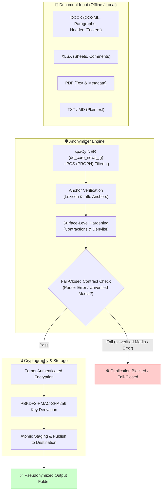
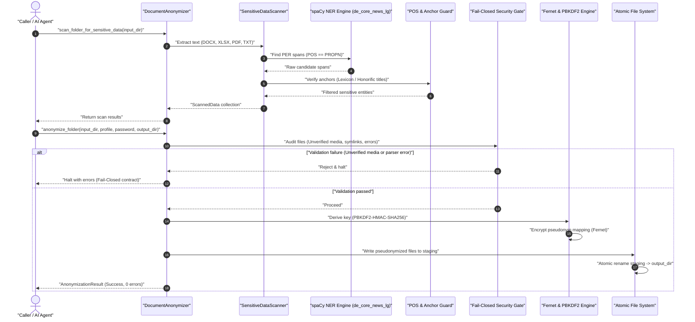

# anonymizer — Standalone Module for Local Document Pseudonymization

**English** | [Deutsch](README_de.md)

[](LICENSE)
[](pyproject.toml)
[](tests/)
[](RELEASE_GATE.md)
[](#legal-framework-and-gdpr-responsibility)
[](#features)
[](llms.txt)
[](README.md)
[](https://github.com/ellmos-ai)
[](#security-contract)

> [!NOTE]
> **AI Agent & LLM Integration Notice:** `anonymizer` provides a machine-readable specification [`llms.txt`](llms.txt) designed for autonomous AI agents (Claude Code, Antigravity, Open-WebUI). Local AI agents requiring privacy-preserving pre-cleared text inputs prior to sending prompts to external LLMs can utilize `anonymizer` completely locally and offline.

> [!IMPORTANT]
> **Privacy & Fail-Closed Security Guarantee:** The core engine processes sensitive personal documents entirely offline without network traffic. If unverified media files, parser errors, or symlinks are detected, publication is halted immediately (`Fail-Closed`) to prevent partial data leakage.

> [!TIP]
> **Ecosystem Synergies:** Integrates seamlessly with other `ellmos-ai` and `open-bricks` components, including [foerderplaner](https://github.com/ellmos-ai/foerderplaner) (educational therapy planning with pseudonymized records), [worksheet-generator](https://github.com/ellmos-ai/worksheet-generator) (client-free educational worksheets), and [ellmos-homebase-mcp](https://github.com/ellmos-ai/ellmos-homebase-mcp).

---

## Quick Navigation

- [Features](#features)
- [Quick Start](#quick-start)
- [System Architecture](#system-architecture)
- [Workflow Sequence](#workflow-sequence)
- [Security Contract](#security-contract)
- [Governance and Runtime Invariants](#governance-and-runtime-invariants)
- [Model Version Sensitivity](#model-version-sensitivity)
- [Supported Formats](#supported-formats)
- [Legal Framework and GDPR Responsibility](#legal-framework-and-gdpr-responsibility)
- [Ecosystem and Sister Modules](#ecosystem-and-sister-modules)
- [Testing and Status](#testing-and-status)
- [License](#license)

---

## Features

`anonymizer` 0.3.1 pseudonymizes documents (`.txt`, `.md`, `.docx`, `.xlsx`, `.pdf`) completely locally without any cloud dependency.

| Feature | Description |
|---|---|
| **Local Security** | Authenticated key encryption (Fernet + PBKDF2), strict fail-closed publication contract |
| **Multi-Format Support** | DOCX (OOXML, paragraphs, tables, headers/footers), XLSX (sheets, comments), PDF, TXT, MD |
| **Named Entity Recognition** | spaCy-based NER (`de_core_news_lg`) with structural POS filtering (`POS == PROPN`) & anchor verification |
| **Surface-Level Hardening** | Model-independent protection against German contraction words ("Beim", "Zum") and role vocabulary |
| **Template Protection** | Hash-verified reference templates for official logos & letterheads without blanket exemptions (`SHA-256`) |
| **Licensing Isolation** | MIT core; optional PDF content-stream redaction (PyMuPDF / AGPL-3.0) strictly isolated in `[pdf-redact]` |
| **Crawler- & Agent-Ready** | Machine-readable `llms.txt` in root directory for seamless autonomous discovery |

---

## Quick Start

### Installation

Virtual environments and keys must reside outside cloud synchronization folders:

```powershell
py -m venv C:\_Local_Anon\venv
C:\_Local_Anon\venv\Scripts\python -m pip install -e "C:\Path\to\anonymizer[all]"
```

`cryptography` and `defusedxml` are mandatory core dependencies. Format extras can be installed selectively as `docx`, `pdf`, `excel`, or collectively as `all` — all four options remain 100% AGPL-free.

PDF **redaction** (actual removal of sensitive text from the PDF content stream) requires the separate extra `pdf-redact` (PyMuPDF, AGPL-3.0):

```powershell
# Standard: Scan, encrypt, AGPL-free
python -m pip install -e ".[all]"

# Additionally for true PDF content-stream redaction:
python -m pip install -e ".[all,pdf-redact]"

# Download spaCy language model
python -m spacy download de_core_news_lg
```

### CLI Command Line

Passwords, name, and birthdate are prompted interactively and securely hidden from process arguments:

```powershell
# 1. Run diagnostic self-test
anonymizer self-test

# 2. Anonymize input case folder
anonymizer anonymize C:\Input\CaseRecords C:\Output\K_ABC123

# 3. Deanonymize when authorized
anonymizer deanonymize C:\Output\K_ABC123 C:\_Local_Anon\keys\K_ABC123.schluessel.enc C:\_Local_Anon\Restored

# 4. Using verified template for letterhead logos
anonymizer anonymize --trusted-template C:\Templates\report_template.docx C:\Input\CaseRecords C:\Output\K_ABC123
```

### Python API

The recommended usage pattern scans first, constructs a profile, and publishes atomically:

```python
import os
from anonymizer_modul import DocumentAnonymizer

# Set secure local key storage directory
os.environ["ANONYMIZER_KEYS_DIR"] = r"C:\_Local_Anon\keys"

anonymizer = DocumentAnonymizer()
scanned = anonymizer.scan_folder_for_sensitive_data(r"C:\Input\CaseRecords")

profile = anonymizer.create_profile(
    real_name="Max Mustermann",  # Synthetic reference name
    geburtsdatum="15.03.2016",
    scanned_data=scanned,
)

result = anonymizer.anonymize_folder(
    folder=r"C:\Input\CaseRecords",
    profile=profile,
    password="a-strong-local-passphrase",
    output_folder=r"C:\Output\K_ABC123",
)

if result.errors:
    raise RuntimeError(f"Anonymization contract violated: {result.errors}")

print(f"Successfully pseudonymized {len(result.processed_files)} documents.")
```

---

## System Architecture



---

## Workflow Sequence

The sequence diagram below illustrates the two-phase analysis, security gates, and authenticated encrypted publishing:



---

## Security Contract

- `anonymize_folder()` publishes either a fully verified target tree or nothing at all (`All-or-Nothing`). Unsupported files, parser failures, symbolic links, naming collisions, and leftover residue halt publication.
- Relative folder and file names are pseudonymized. The single-file API rejects identifying filenames because its return value does not transport a new path; for such tasks, the folder workflow is required.
- Keyfiles are authenticated and encrypted with Fernet; the key is derived via PBKDF2-HMAC-SHA256 (minimum 100,000 iterations) from a passphrase. Storage and ENV overrides within known cloud synchronization paths are actively rejected.
- Deanonymized plaintext folders must not be written to known cloud sync paths.
- Automatic person name recognition operates fail-closed by default: if spaCy or configured language models are missing, the scan terminates. A reduced mode must be explicitly opted into with `require_ner=False`.
- The NER name detection structurally validates identified PER spans via Part-of-Speech (`POS`): capitalization in German is **not** an indicator of personal names (every noun is capitalized), so only tokens tagged as proper nouns (`PROPN`) are retained. Overly broad spans are trimmed to their maximum contiguous name subsequence rather than entirely discarded.
- **Anchor Principle:** Multi-word NER matches (≥2 tokens, e.g. Firstname + Lastname) are considered sufficiently verified. Single-word matches are replaced only if an anchor is present: a known first name (lexicon) OR an immediately preceding honorific/title token ("Dr.", "Prof.", "Frau", "Herr"). Without an anchor, no destructive replacement occurs — the finding is routed to `ner_review_only` for human inspection.
- **Model-Version-Robust Surface Hardening:** Candidates are surface-hardened independently of POS/lemma models: preposition-article contractions ("Beim", "Zum") are rejected, administrative vocabulary is filtered via prefix matching, and a dictionary check protects common words that would otherwise start a new subsequence.
- Embedded media (`word/media`, `xl/media`) in DOCX/XLSX halts publication by default (no OCR guarantee). An optional trusted reference template (`trusted_template_path`) allows specific media entries whose SHA-256 hash matches the template byte-for-byte.
- PDF redaction is non-reversible. `DocumentDeanonymizer` merely copies previously redacted PDFs; restoring original redacted PDF text is technically impossible.

---

## Governance and Runtime Invariants

| Invariant | Name | Guarantee & Security Specification |
|---|---|---|
| `INV-LOCAL-01` | Zero Network Egress | The engine performs zero outgoing network requests or cloud telemetry; all scans and transformations are 100% offline. |
| `INV-LOCAL-02` | Fail-Closed Contract | Any unexpected file format, parser failure, or symbolic link immediately halts publication before disk commit. |
| `INV-LOCAL-03` | Authenticated Encryption | Keyfiles are Fernet-encrypted via PBKDF2-HMAC-SHA256; storage inside cloud sync directories is actively blocked. |
| `INV-LOCAL-04` | Structural POS Filtering | spaCy PER spans require `POS == PROPN` filtering to prevent common German nouns from being erroneously redacted. |
| `INV-LOCAL-05` | Anchor Verification | Single-word candidate names strictly require an anchor (title or lexicon entry); otherwise routed to `ner_review_only`. |
| `INV-LOCAL-06` | Surface Hardening | German contractions ("Beim", "Zum") and administrative terms are filtered via prefix matching independently of model versions. |
| `INV-LOCAL-07` | Trusted Template SHA-256 | Embedded media in office files passes publication only upon byte-identical SHA-256 hash matching against a trusted template. |
| `INV-LOCAL-08` | AGPL Licensing Boundary | PDF content-stream redaction (PyMuPDF) is quarantined strictly in `pdf-redact`; core and default installations remain pure MIT. |
| `INV-LOCAL-09` | GDPR Art. 4(5) Parity | Architected as pseudonymization with authorized re-identification capabilities, not destructive irreversible destruction. |
| `INV-LOCAL-10` | Atomic Directory Publish | Destination directories are assembled in isolated staging and swapped via atomic filesystem rename to prevent partial exposures. |

---

## Model Version Sensitivity

Automatic person name detection relies on installed spaCy models — tested and recommended is `de_core_news_lg` **3.8.0** (spaCy **3.8.14**). Different model versions may yield different POS tags and lemmatizations.

**Important Operational Notice (RUN5 Finding):**
If the English `en_core_web_lg` model is also installed, it may erroneously tag German running text as `PERSON` — with lemmatization behaviors divergent from German linguistic rules (e.g. retaining capitalization on substantivized prepositions). Pure POS/lemma filtering does not reliably intercept this cross-model pattern. Therefore, version 0.3.1 incorporates model-independent surface hardening (contraction filters, prefix matching, German vocabulary checks).

Production recommendation: Install `en_core_web_lg` only if English documents are actually processed. For pure German document repositories, `de_core_news_lg` alone is sufficient and avoids cross-contamination.

---

## Supported Formats

| Format | Redaction & Parsing Behavior |
|---|---|
| `.txt`, `.md` | Word-boundary safe replacement of names, addresses, and entities |
| `.docx` | Paragraphs, tables, and package-wide OOXML text/attributes including headers/footers, comments, and document metadata |
| `.xlsx` | Cell values, dates, and package-wide OOXML attributes including comments, sheet metadata, and chart titles |
| `.pdf` | True text redaction (with `pdf-redact`); removal of metadata, annotations, forms, links, attachments, and bookmarks |
| `.doc` | Limited external text extraction; safe plaintext output as `.txt` |

### PDF Redaction: Licensing Boundary (Decision E08)

`anonymizer` is MIT-licensed. **Scanning** PDFs relies on [`pypdf`](https://pypi.org/project/pypdf/) (BSD-3-Clause), optional **encryption** relies on [`pikepdf`](https://pypi.org/project/pikepdf/) (MPL-2.0) — both permissive.

Actual **content-stream redaction** (`_anonymize_pdf`) requires [PyMuPDF](https://pypi.org/project/PyMuPDF/) (AGPL-3.0) because it removes sensitive text directly from the PDF content stream rather than merely drawing a visual black box over it. Therefore, this boundary is explicitly quarantined:

- PyMuPDF resides exclusively in the separate extra `pdf-redact` — **not** in `pdf` or `all`. `pip install anonymizer-modul[all]` remains 100% AGPL-free.
- Without `pdf-redact`, scanning and encrypting PDFs functions normally; `_anonymize_pdf()` cleanly returns `(False, 0)`.
- `tests/test_no_agpl.py` enforces this boundary as a mandatory CI gate.

---

## Legal Framework and GDPR Responsibility

`anonymizer` **pseudonymizes** documents — it does not anonymize in the absolute legal sense. Under Art. 4(5) GDPR, pseudonymization replaces identifying attributes with a pseudonym without permanently eliminating the personal reference: the encrypted keyfile explicitly allows authorized re-identification (`DocumentDeanonymizer`). Processed documents therefore remain personal data under the GDPR, and legal compliance (Art. 5, 6, 24, 32 GDPR) remains the sole responsibility of the operator.

> [!NOTE]
> **Statutory Liability Disclaimer (German Law § 521 BGB):** This open-source software is provided free of charge. Under § 521 of the German Civil Code (BGB), liability of the authors and contributors is restricted to intent and gross negligence. The software is provided "as is", without warranty of any kind, express or implied, regarding merchantability, fitness for a particular purpose, or non-infringement.

For **professionals bound by statutory confidentiality duties** (e.g. German § 203 StGB — medical doctors, therapists, attorneys, social workers): using `anonymizer` does not discharge professional secrecy obligations. Sharing pseudonymized documents with third parties must be evaluated independently. The module gives **no guarantee** that all personal data is detected (NER is model-based and fallible). A manual final review before disclosure is always required.

---

## Ecosystem and Sister Modules

`anonymizer` serves as a core privacy building block across the local open-source ecosystem:

| Module / Repository | Role & Interface |
|---|---|
| [foerderplaner](https://github.com/ellmos-ai/foerderplaner) | Structured educational therapy reporting using pseudonymized records |
| [worksheet-generator](https://github.com/ellmos-ai/worksheet-generator) | Educational worksheet generation operating completely free of personal data |
| [report-forge](https://github.com/ellmos-ai/report-forge) | Automated reporting pipelines for sanitized institutional dossiers |
| [usmc](https://github.com/ellmos-ai/usmc) / [memoryhooker](https://github.com/ellmos-ai/memoryhooker) | Local agent memory without persistent storage of sensitive plaintext identities |
| [ellmos-homebase-mcp](https://github.com/ellmos-ai/ellmos-homebase-mcp) | MCP gateway for secure, isolated local agent tool execution |
| [open-bricks](https://github.com/open-bricks) | Umbrella initiative and distribution hub for modular desktop & CLI utilities |

---

## Testing and Status

```powershell
# Bytecode verification
python -m py_compile anonymizer_modul\core.py

# Full test suite (89 contract & unit tests)
python -m pytest -v

# AGPL boundary guardian test
python -m pytest tests\test_no_agpl.py

# CLI self-test
python -m anonymizer_modul.core self-test
```

Auditing and compliance documents:
- `RELEASE_GATE.md`: Security release verification gate
- `SECURITY.md`: Vulnerability reporting and security model
- `SECURITY_REVIEW_2026-07-16.md`: In-depth GDPR privacy audit
- `THIRD_PARTY_LICENSES.md`: Comprehensive SBOM and dependency licensing audit

---

## License

This project is licensed under the **MIT License** — see [LICENSE](LICENSE) for details. Third-party package licenses and governance boundaries are documented in [THIRD_PARTY_LICENSES.md](THIRD_PARTY_LICENSES.md).

Origin: Extracted from BACH `hub/_services/document/anonymizer_service.py` v1.2.0 and neutralized as an autonomous standalone tool.
