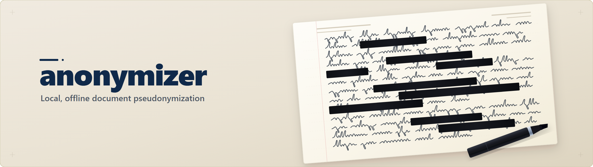
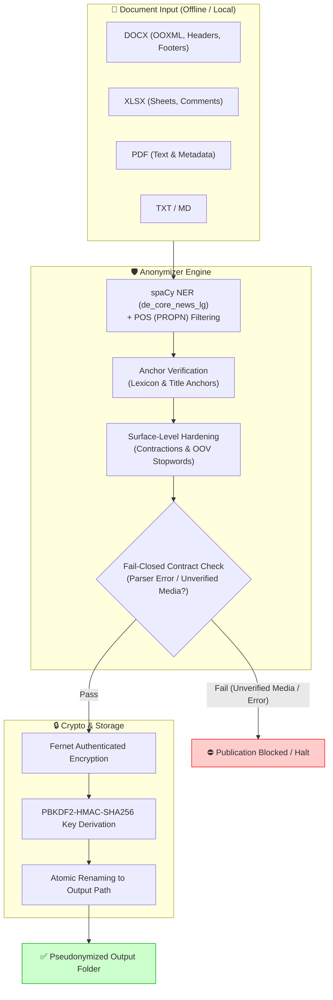

# anonymizer — Standalone-Modul

[](LICENSE)
[](pyproject.toml)
[](RELEASE_GATE.md)
[](#rechtlicher-rahmen-und-verantwortung)
[](llms.txt)
[](https://github.com/ellmos-ai)
[](#sicherheitsvertrag)

> [!NOTE]
> **AI Agent & LLM Integration Notice**: `anonymizer` provides a machine-readable [`llms.txt`](llms.txt) for automated AI agent discovery and integration. AI agents requiring privacy-preserving pre-cleared text inputs prior to sending prompts to external LLMs can utilize `anonymizer` locally and offline.

`anonymizer` 0.2.5 pseudonymisiert lokale Dokumente (`.txt`, `.md`, `.docx`, `.xlsx`, `.pdf`) vollständig lokal und ohne Cloud-Abhängigkeit.

| Feature | Beschreibung |
|---|---|
| **Lokale Sicherheit** | Authentifizierte Key-Verschlüsselung (Fernet + PBKDF2), Fail-closed Publikationsvertrag |
| **Formate** | DOCX (inkl. OOXML, Tabellen, Header/Footer), XLSX, PDF, TXT, MD |
| **Namenerkennung** | spaCy-basierte NER (POS==PROPN) + Anker-Validierung & Modellversions-Härtung |
| **Templates** | Hash-verifizierte Referenztemplates für Logos & Briefköpfe ohne Pauschalfreigabe |
| **Crawler-Ready** | Maschinenlesbares `llms.txt` für KI-Agenten & Discovery im Root hinterlegt |

Das Modul verarbeitet sensible personenbezogene Daten ausschließlich lokal;
Verantwortung, Grenzen und rechtlicher Rahmen der Nutzung stehen unter
„Rechtlicher Rahmen und Verantwortung" weiter unten.

## Systemarchitektur



## Sicherheitsvertrag

- `anonymize_folder()` veröffentlicht entweder einen vollständig geprüften
  Zielbaum oder gar keinen. Nicht unterstützte Dateien, Parserfehler,
  symbolische Links, Kollisionen und Restdaten stoppen die Veröffentlichung.
- Relative Ordner- und Dateinamen werden pseudonymisiert. Die Einzeldatei-API
  verweigert identifizierende Dateinamen, weil ihr Rückgabewert keinen neuen
  Pfad transportiert; für solche Eingaben ist der Ordner-Workflow vorgesehen.
- Schlüsseldateien werden mit Fernet authentifiziert verschlüsselt; der
  Schlüssel wird per PBKDF2-HMAC-SHA256 aus einem Passwort abgeleitet. Ablage
  und ENV-Override in bekannten Cloud-Sync-Pfaden werden abgelehnt.
- De-anonymisierte Klartextordner dürfen nicht in bekannte Cloud-Sync-Pfade
  geschrieben werden.
- Die automatische Personennamenerkennung arbeitet standardmäßig fail-closed:
  fehlen spaCy oder die konfigurierten Modelle, bricht der Scan ab. Ein
  reduzierter Modus muss explizit mit `require_ner=False` gewählt werden.
- Die NER-Personennamenerkennung validiert erkannte PER-Spans strukturell
  über die Wortart (POS): Großschreibung ist im Deutschen **kein**
  Personen-Signal (jedes Substantiv wird großgeschrieben), daher zählen nur
  als Eigenname (PROPN) getaggte Tokens als Namensbestandteil. Ein zu weit
  gefasster NER-Span wird auf seine maximale zusammenhängende
  Namens-Teilsequenz gekürzt statt ganz verworfen (z. B. „Kim" aus „Grob
  bewegt Kim sich"), zusätzlich abgesichert durch eine Gattungsbegriff-
  Denyliste (Verwaltungs-, Rollen- und Berichtsvokabular wie „Landkreis",
  „Förderung") auf Lemma- **und** Oberflächenform-Basis (deckt auch
  Flexionsformen wie „Landkreises" ab).
- **Anker-Prinzip (0.2.3):** Reines POS==PROPN erwies sich in der Praxis
  als zu durchlässig (spaCy misstaggt Substantive in Aufzählungs-/
  Fachtext-Kontexten häufig als PROPN). Mehrwort-NER-Treffer (≥2 Tokens
  nach der Kürzung, Vor+Nachname-Muster wie „Amara Diallo") gelten als
  hinreichend verifiziert. Einzelwort-Treffer werden nur ersetzt, wenn ein
  Anker vorliegt: ein bekannter deutscher Vorname (Lexikon) ODER ein
  unmittelbar vorangehendes Titel-/Anrede-Token („Dr.", „Prof.", „Frau",
  „Herr"). Ohne Anker erfolgt **keine** destruktive Ersetzung — der Treffer
  landet stattdessen sichtbar im Scan-Ergebnis (`ner_review_only`) zur
  manuellen Prüfung. Der eigentliche Klientenname kommt unabhängig davon
  immer über `real_name`/`weitere_namen` ins Profil (Kernzweck,
  unverändert) — das Anker-Prinzip betrifft nur automatisch erkannte
  Drittpersonen.
- **Modellversions-robuste Oberflächen-Härtung (0.2.5):** Ergänzend zur
  POS-/Lemma-Prüfung wird jeder Span-Kandidat zusätzlich rein
  oberflächenbasiert gehärtet (Präposition-Artikel-Kontraktionen wie
  „Beim"/„Zum" werden immer verworfen; Gattungsbegriffe zusätzlich per
  Präfixmatch statt Lemma; ein Alltagswort-Check gegen das deutsche
  Vokabular für Wörter, die eine neue Teilsequenz eröffnen würden). Details
  und Hintergrund siehe „Modellversions-Sensitivität" unten.
- `word/media`/`xl/media`-Einträge (eingebettete Bilder) in DOCX/XLSX
  blockieren standardmäßig die Veröffentlichung (keine OCR-Garantie). Ein
  optionales, vertrauenswürdiges Template (`trusted_template_path`/CLI
  `--trusted-template`/ENV `ANONYMIZER_TRUSTED_TEMPLATE`) erlaubt gezielt
  Medien, deren SHA-256-Hash byte-identisch aus diesem Template stammt —
  jeder andere oder abweichende Medien-Eintrag blockiert weiterhin. Siehe
  „Unterstützte Formate" für Details.

## Modellversions-Sensitivität

Die Qualität der automatischen Personennamenerkennung hängt vom installierten
spaCy-Modell ab — getestet und empfohlen ist `de_core_news_lg` **3.8.0**
(spaCy **3.8.14**). Ältere/neuere Modellversionen können abweichende
POS-Tags/Lemmata liefern und damit die Trefferquote verändern.

**Wichtiger Betriebshinweis (RUN5-Befund, 2026-07-23):** Ist zusätzlich das
englische `en_core_web_lg`-Modell installiert (`NER_MODELS` verarbeitet
standardmäßig DE **und** EN), kann es deutschen Fließtext eigenständig
fehlerhaft als `PERSON` taggen — mit Lemmata, die sich nicht wie die
deutsche Lemmatisierung verhalten (z. B. bleibt das Lemma einer
substantivierten Präposition/eines Verbs bei der englischen Pipeline
großgeschrieben, während die deutsche Pipeline korrekt kleinschreibt). Die
reine POS-/Lemma-Prüfung (0.2.2–0.2.4) greift gegen dieses Muster nicht
zuverlässig; deshalb ergänzt 0.2.5 eine vom Modell/der Version unabhängige
Oberflächen-Härtung (Kontraktionswörter, Gattungsbegriff-Präfixmatch,
deutsches Vokabular-Check). Automatisiert gegen beide Konstellationen
getestet (mit und ohne installiertes `en_core_web_lg`) — Details siehe
`CHANGELOG.md` 0.2.5 und `tests/test_security_boundaries.py`
(`test_ner_run5_english_model_cross_contamination_hardened`).

Empfehlung für produktive Installationen: `en_core_web_lg` nur installieren,
wenn tatsächlich englischsprachige Dokumente anonymisiert werden — für rein
deutsche Aktenbestände genügt `de_core_news_lg` allein und vermeidet dieses
Fehlerbild von vornherein.

```
# requirements/pyproject-Kommentar (empfohlene, getestete Version):
# de_core_news_lg==3.8.0  (spacy==3.8.14)
```

## Unterstützte Formate

| Format | Verhalten |
|---|---|
| `.txt`, `.md` | wortgrenzensichere Ersetzung |
| `.docx` | Absätze, Tabellen und paketweite OOXML-Texte/-Attribute einschließlich Kopf-/Fußzeilen, Kommentare, Diagramme und Metadaten |
| `.xlsx` | Zellen, Datumswerte und paketweite OOXML-Texte/-Attribute einschließlich Kommentare, Charttitel, Links, Blatt- und Dokumentmetadaten |
| `.pdf` | Textschwärzung; Metadaten, Annotationen, Formulare, Links, Anhänge, Bookmarks und Page-Labels werden entfernt |
| `.doc` | begrenzte externe Textextraktion; sichere Ausgabe als `.txt` |

Bild- oder eingebettete Binärinhalte in DOCX/XLSX und bildhaltige PDFs werden
standardmäßig abgelehnt, weil das Modul keine OCR-Garantie geben kann.
`allow_unverified_media=True` ist nur für einen separat geprüften lokalen
Workflow vorgesehen und darf nicht als vollständige Anonymisierung gelten.

**Vertrauenswürdiges Template statt Pauschal-Freigabe:** Ein produktives
Berichts-Template (z. B. mit Briefkopf-Logo) enthält typischerweise
`word/media`/`xl/media`-Bilder, die den fail-closed-Medienstopp sonst bei
jeder darauf basierenden DOCX/XLSX auslösen würden — auch bei der eigenen
De-Anonymisierung des fertig ausgefüllten Berichts. Statt pauschal
`allow_unverified_media=True` zu setzen, kann ein Template als Referenz
angegeben werden:

```python
anonymizer = DocumentAnonymizer(trusted_template_path=r"C:\Vorlagen\bericht.docx")
```

Beim Verarbeiten einer Datei werden die SHA-256-Hashes aller
`word/media`/`xl/media`-Einträge der Zieldatei gegen die Hashes der
Template-Bilder geprüft. Nur byte-identische Treffer gelten als verifiziert
und passieren; jedes andere, veränderte oder fremde Bild blockiert weiterhin
die Veröffentlichung — `word/embeddings`, `word/activeX` sowie
VBA-/OLE-Payloads bleiben davon unberührt und sperren unverändert immer. CLI:
`--trusted-template <pfad>` bei `anonymize` und `deanonymize`; alternativ die
Umgebungsvariable `ANONYMIZER_TRUSTED_TEMPLATE`.

Ordner werden zunächst vollständig in einer lokalen Arbeitsfläche geprüft.
Der fertige Zielbaum wird anschließend über einen gleichvolumigen
Geschwisterpfad in einer atomaren Umbenennung sichtbar; Kopier- oder
Umbenennungsfehler veröffentlichen keinen Teilbaum.

PDF-Schwärzung ist nicht reversibel. `DocumentDeanonymizer` kopiert bereits
geschwärzte PDFs lediglich weiter; eine vollständige Wiederherstellung wird
nicht versprochen.

## Rechtlicher Rahmen und Verantwortung

`anonymizer` **pseudonymisiert** Dokumente — es anonymisiert im
datenschutzrechtlichen Sinn nicht. Nach Art. 4 Nr. 5 DSGVO ersetzt
Pseudonymisierung identifizierende Merkmale durch ein Pseudonym, ohne den
Personenbezug technisch endgültig aufzuheben: Die verschlüsselte
Zuordnungstabelle (siehe „Sicherheitsvertrag") macht eine Re-Identifizierung
durch den Verwender bewusst möglich (`DocumentDeanonymizer`). Die
verarbeiteten Dokumente bleiben deshalb personenbezogene Daten im Sinne der
DSGVO, und die Verantwortung für Rechtsgrundlage, Zweckbindung,
Speicherbegrenzung und technisch-organisatorische Maßnahmen (Art. 5, 6, 24,
32 DSGVO) verbleibt vollständig beim Verwender des Moduls. Das Modul liefert
eine technische Schutzmaßnahme, keine rechtliche Bewertung und keine Garantie
für einen bestimmten DSGVO-Compliance-Status.

Für **Berufsgeheimnisträger** (§ 203 StGB, z. B. Ärzt:innen,
Psychotherapeut:innen, Rechtsanwält:innen, Sozialarbeiter:innen) gilt
zusätzlich: Der Einsatz von `anonymizer` entbindet nicht von den
berufsrechtlichen Schweigepflichten. Insbesondere bleibt die Weitergabe
pseudonymisierter Dokumente an Dritte (einschließlich Cloud-Dienste,
KI-Anbieter oder sonstige Auftragsverarbeiter) eigenverantwortlich zu prüfen.
Das Modul gibt — wie unter „Unterstützte Formate" und in `SECURITY.md`
dokumentiert — **keine Garantie**, dass sämtliche personenbezogenen Daten
vollständig erkannt und entfernt werden: Die Personennamenerkennung (NER) ist
modellbasiert und fehleranfällig, bildhaltige Inhalte werden ohne
OCR-Prüfung standardmäßig abgelehnt, und nicht unterstützte Formate werden
nicht verarbeitet. Vor jeder Weitergabe ist eine manuelle Endkontrolle durch
den Verwender erforderlich.

**Legal note (English summary):** `anonymizer` performs pseudonymization, not
GDPR-grade anonymization — identifying data is replaced by a reversible
pseudonym (Art. 4(5) GDPR), and the encrypted key file allows
re-identification by design. Processed documents remain personal data under
GDPR; legal basis, purpose limitation, and technical/organizational measures
(Art. 5, 6, 24, 32 GDPR) remain the sole responsibility of the operator. For
professionals bound by statutory confidentiality duties (e.g., doctors,
therapists, lawyers — cf. German § 203 StGB and equivalent regimes
elsewhere), using this module does not discharge those duties, and sharing
pseudonymized output with third parties (including cloud or AI providers)
must be assessed independently. The module gives **no guarantee** that all
personal data is detected and removed — NER is model-based and fallible,
image content is rejected by default without OCR verification, and
unsupported formats are not processed. A manual final review before
disclosure is required.

## Installation

Virtuelle Umgebungen und Schlüssel gehören außerhalb von OneDrive:

```powershell
py -m venv C:\_Local_Anon\venv
C:\_Local_Anon\venv\Scripts\python -m pip install -e "C:\Pfad\zu\anonymizer[all]"
```

`cryptography` ist Pflichtabhängigkeit. Format-Extras können gezielt als
`docx`, `pdf`, `excel` oder gemeinsam als `all` installiert werden. Die
spaCy-Modelle werden separat installiert:

```powershell
python -m spacy download de_core_news_lg
python -m spacy download en_core_web_lg
```

## Python-API

Das sichere Nutzungsmuster scannt zuerst, erstellt aus allen Treffern ein
Profil und veröffentlicht anschließend in einen neuen/leeren Zielpfad:

```python
import os
from anonymizer_modul import DocumentAnonymizer

os.environ["ANONYMIZER_KEYS_DIR"] = r"C:\_Local_Anon\keys"

anonymizer = DocumentAnonymizer()
scanned = anonymizer.scan_folder_for_sensitive_data(r"C:\Eingang\Fallakte")
profile = anonymizer.create_profile(
    real_name="Max Mustermann",       # ausschließlich fiktives Beispiel
    geburtsdatum="15.03.2016",
    scanned_data=scanned,
)
result = anonymizer.anonymize_folder(
    folder=r"C:\Eingang\Fallakte",
    profile=profile,
    password="ein-langes-lokales-passwort",
    output_folder=r"C:\Ausgang\K_ABC123",
)
if result.errors:
    raise RuntimeError("Anonymisierung wurde nicht veröffentlicht")
```

Fehlermeldungen und Fortschrittsdaten verwenden absichtlich nur opake
Dateiindizes. Sie enthalten keine Quellnamen oder absoluten Pfade.

## CLI

Passwörter, Name und Geburtsdatum werden verborgen abgefragt und erscheinen
nicht in Prozessargumenten:

```powershell
anonymizer self-test
anonymizer anonymize C:\Eingang\Fallakte C:\Ausgang\K_ABC123
anonymizer deanonymize C:\Ausgang\K_ABC123 C:\_Local_Anon\keys\K_ABC123.schluessel.enc C:\_Local_Anon\Wiederhergestellt

# Mit Template-Bildern (Briefkopf/Logo) im Berichts-Template:
anonymizer anonymize --trusted-template C:\Vorlagen\bericht.docx C:\Eingang\Fallakte C:\Ausgang\K_ABC123
anonymizer deanonymize --trusted-template C:\Vorlagen\bericht.docx C:\Ausgang\K_ABC123 C:\_Local_Anon\keys\K_ABC123.schluessel.enc C:\_Local_Anon\Wiederhergestellt
```

Der installierte Entry-Point und `python -m anonymizer_modul.core` verwenden
dieselben Befehle und liefern bei ungültigen Kommandos einen Exitcode ungleich
null.

## Tests und Status

```powershell
python -m py_compile anonymizer_modul\core.py
python -m pytest -q
python -m anonymizer_modul.core self-test
```

Der aktuelle Prüfstand steht in `RELEASE_GATE.md`; die detaillierte
Datenschutzprüfung in `SECURITY_REVIEW_2026-07-16.md`.

## Integration

Der aktuell nachgewiesene Konsument ist der foerderplaner-Skill mit einem
Reexport-Shim. Es gibt in diesem Checkout keine angebundene `FoerderDB`.
Die exakten Pfade und Verantwortungsgrenzen stehen in `WIRING.md`.

Lizenz: MIT. Herkunft: aus BACH
`hub/_services/document/anonymizer_service.py` v1.2.0 extrahiert und als
Standalone-Modul neutralisiert.
