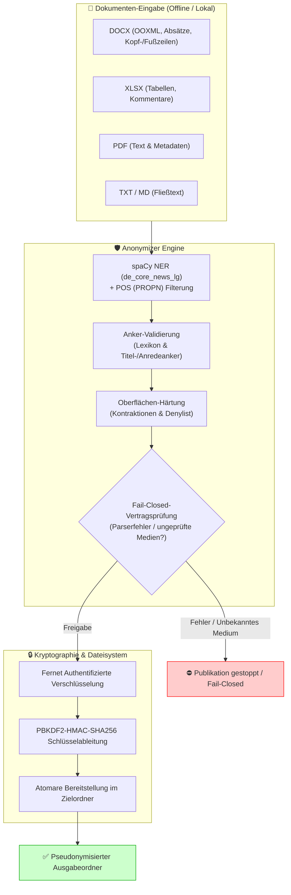
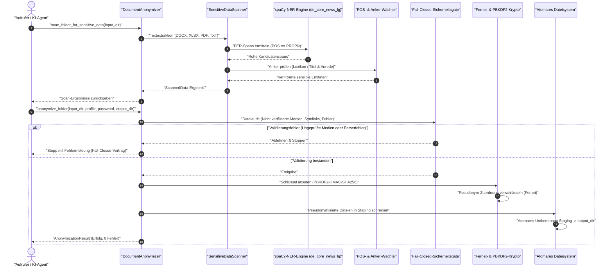

# anonymizer — Standalone-Modul für lokale Dokument-Pseudonymisierung

[English](README.md) | **Deutsch**

[](LICENSE)
[](pyproject.toml)
[](tests/)
[](RELEASE_GATE.md)
[](#rechtlicher-rahmen-und-verantwortung)
[](#funktionsumfang)
[](llms.txt)
[](README_de.md)
[](https://github.com/ellmos-ai)
[](#sicherheitsvertrag)

> [!NOTE]
> **KI-Agenten- & LLM-Integration:** `anonymizer` stellt eine maschinenlesbare Spezifikation [`llms.txt`](llms.txt) für autonome Agenten (Claude Code, Antigravity, Open-WebUI) bereit. Lokale Agenten können vertrauliche Klientendaten vor der Übergabe an externe Cloud-LLMs vollständig offline pseudonymisieren.

> [!IMPORTANT]
> **Datenschutz & Fail-Closed-Sicherheitsvertrag:** Das Modul verarbeitet sensible Dokumente ausschließlich lokal und offline ohne jeglichen Netzwerkverkehr. Werden nicht verifizierbare Mediendateien, Parserfehler oder Symlinks erkannt, stoppt die Publikation sofort vollständig (`Fail-Closed`), um unvollständige Datenabflüsse auszuschließen.

> [!TIP]
> **Ökosystem-Synergien:** Arbeitet nahtlos mit anderen `ellmos-ai`- und `open-bricks`-Bausteinen zusammen, z. B. [foerderplaner](https://github.com/ellmos-ai/foerderplaner) (Förderplanung mit pseudonymisierten Daten), [worksheet-generator](https://github.com/ellmos-ai/worksheet-generator) (personenbezugfreie Arbeitsblätter) und [ellmos-homebase-mcp](https://github.com/ellmos-ai/ellmos-homebase-mcp).

---

## Schnellnavigation

- [Funktionsumfang](#funktionsumfang)
- [Schnellstart](#schnellstart)
- [Systemarchitektur](#systemarchitektur)
- [Arbeitsablauf-Sequenz](#arbeitsablauf-sequenz)
- [Sicherheitsvertrag](#sicherheitsvertrag)
- [Governance- & Laufzeit-Invarianten](#governance--und-laufzeit-invarianten)
- [Modellversions-Sensitivität](#modellversions-sensitivitaet)
- [Unterstützte Formate](#unterstuetzte-formate)
- [Rechtlicher Rahmen und Verantwortung](#rechtlicher-rahmen-und-verantwortung)
- [Ökosystem und Geschwister-Module](#oekosystem-und-geschwister-module)
- [Tests und Status](#tests-und-status)
- [Lizenz](#lizenz)

---

## Funktionsumfang

`anonymizer` 0.3.0 pseudonymisiert Dokumente (`.txt`, `.md`, `.docx`, `.xlsx`, `.pdf`) vollständig lokal und ohne Cloud-Abhängigkeit.

| Feature | Beschreibung |
|---|---|
| **Lokale Sicherheit** | Authentifizierte Key-Verschlüsselung (Fernet + PBKDF2), Fail-Closed-Publikationsvertrag |
| **Multi-Format-Unterstützung** | DOCX (inkl. OOXML, Tabellen, Header/Footer), XLSX (Tabellenblätter, Kommentare), PDF, TXT, MD |
| **Namenerkennung** | spaCy-basierte NER (`de_core_news_lg`) mit POS-Filterung (`POS == PROPN`) & Anker-Validierung |
| **Oberflächen-Härtung** | Modellversionsunabhängige Abwehr von Kontraktionen („Beim", „Zum") und Verwaltungswort-Filter |
| **Template-Schutz** | Hash-verifizierte Referenztemplates für Logos & Briefköpfe ohne Pauschalfreigabe (`SHA-256`) |
| **Lizenz-Isolation** | MIT-Kern; optionale PDF-Inhaltsstrom-Schwärzung (PyMuPDF / AGPL-3.0) strikt in `[pdf-redact]` isoliert |
| **Crawler- & Agent-Ready** | Maschinenlesbares `llms.txt` im Root für direkte Erkennung durch KI-Agenten |

---

## Schnellstart

### Installation

Virtuelle Umgebungen und Schlüssel gehören außerhalb von Cloud-Sync-Ordnern:

```powershell
py -m venv C:\_Local_Anon\venv
C:\_Local_Anon\venv\Scripts\python -m pip install -e "C:\Pfad\zu\anonymizer[all]"
```

`cryptography` und `defusedxml` sind Kernabhängigkeiten. Format-Extras können gezielt als `docx`, `pdf`, `excel` oder gemeinsam als `all` installiert werden — alle vier bleiben vollständig AGPL-frei.

PDF-**Schwärzung** (echte Textentfernung aus dem Inhaltsstrom) benötigt das separate Extra `pdf-redact` (PyMuPDF, AGPL-3.0):

```powershell
# Standard: Scannen, Verschlüsseln, AGPL-frei
python -m pip install -e ".[all]"

# Zusätzlich für echte PDF-Schwärzung:
python -m pip install -e ".[all,pdf-redact]"

# spaCy Sprachmodelle laden
python -m spacy download de_core_news_lg
```

### CLI-Befehlszeile

Passwörter, Name und Geburtsdatum werden verborgen abgefragt und erscheinen nicht in den Prozessargumenten:

```powershell
# 1. Selbsttest ausführen
anonymizer self-test

# 2. Eingangsordner pseudonymisieren
anonymizer anonymize C:\Eingang\Fallakte C:\Ausgang\K_ABC123

# 3. Bei Bedarf de-pseudonymisieren
anonymizer deanonymize C:\Ausgang\K_ABC123 C:\_Local_Anon\keys\K_ABC123.schluessel.enc C:\_Local_Anon\Wiederhergestellt

# 4. Mit verifiziertem Template für Briefkopf-Logos
anonymizer anonymize --trusted-template C:\Vorlagen\bericht.docx C:\Eingang\Fallakte C:\Ausgang\K_ABC123
```

### Python-API

Das empfohlene Nutzungsmuster scannt zuerst, erstellt ein Profil und veröffentlicht anschließend atomar:

```python
import os
from anonymizer_modul import DocumentAnonymizer

# Schlüsselverzeichnis sicher lokal setzen
os.environ["ANONYMIZER_KEYS_DIR"] = r"C:\_Local_Anon\keys"

anonymizer = DocumentAnonymizer()
scanned = anonymizer.scan_folder_for_sensitive_data(r"C:\Eingang\Fallakte")

profile = anonymizer.create_profile(
    real_name="Max Mustermann",  # Synthetisches Beispiel
    geburtsdatum="15.03.2016",
    scanned_data=scanned,
)

result = anonymizer.anonymize_folder(
    folder=r"C:\Eingang\Fallakte",
    profile=profile,
    password="ein-sicheres-lokales-passwort",
    output_folder=r"C:\Ausgang\K_ABC123",
)

if result.errors:
    raise RuntimeError(f"Anonymisierung fehlgeschlagen: {result.errors}")

print(f"Erfolgreich pseudonymisiert: {len(result.processed_files)} Dateien.")
```

---

## Systemarchitektur



---

## Arbeitsablauf-Sequenz

Das folgende Sequenzdiagramm veranschaulicht den zweistufigen Ablauf aus Analyse, Sicherheits-Gates und verschlüsselter Veröffentlichung:



---

## Sicherheitsvertrag

- `anonymize_folder()` veröffentlicht entweder einen vollständig geprüften Zielbaum oder gar keinen (`All-or-Nothing`). Nicht unterstützte Dateien, Parserfehler, symbolische Links, Namenskollisionen und Restdaten stoppen die Veröffentlichung.
- Relative Ordner- und Dateinamen werden pseudonymisiert. Die Einzeldatei-API verweigert identifizierende Dateinamen, da ihr Rückgabewert keinen neuen Pfad transportiert; für solche Eingaben ist der Ordner-Workflow vorgesehen.
- Schlüsseldateien werden mit Fernet authentifiziert verschlüsselt; der Schlüssel wird per PBKDF2-HMAC-SHA256 (mindestens 100.000 Iterationen) aus einem Passwort abgeleitet. Die Ablage und ENV-Overrides in bekannten Cloud-Sync-Pfaden werden aktiv abgelehnt.
- De-anonymisierte Klartextordner dürfen nicht in bekannte Cloud-Sync-Pfade geschrieben werden.
- Die automatische Personennamenerkennung arbeitet standardmäßig fail-closed: Fehlen spaCy oder die konfigurierten Modelle, bricht der Scan ab. Ein reduzierter Modus muss explizit mit `require_ner=False` gewählt werden.
- Die NER-Personennamenerkennung validiert erkannte PER-Spans strukturell über die Wortart (POS): Großschreibung ist im Deutschen **kein** Personen-Signal (jedes Substantiv wird großgeschrieben), daher zählen nur als Eigenname (`PROPN`) getaggte Tokens als Namensbestandteil. Ein zu weit gefasster NER-Span wird auf seine maximale zusammenhängende Namens-Teilsequenz gekürzt statt ganz verworfen.
- **Anker-Prinzip:** Mehrwort-NER-Treffer (≥2 Tokens, Vor+Nachname-Muster) gelten als hinreichend verifiziert. Einzelwort-Treffer werden nur ersetzt, wenn ein Anker vorliegt: ein bekannter deutscher Vorname (Lexikon) ODER ein unmittelbar vorangehendes Titel-/Anrede-Token („Dr.", „Prof.", „Frau", „Herr"). Ohne Anker erfolgt keine destruktive Ersetzung — der Treffer landet im Scan-Ergebnis (`ner_review_only`) zur manuellen Prüfung.
- **Modellversions-robuste Oberflächen-Härtung:** Ergänzend zur POS-/Lemma-Prüfung wird jeder Span-Kandidat zusätzlich rein oberflächenbasiert gehärtet: Präposition-Artikel-Kontraktionen („Beim", „Zum") werden verworfen; Gattungsbegriffe per Präfixmatch gefiltert; ein deutsches Vokabular-Check schützt Wörter, die eine neue Teilsequenz eröffnen würden.
- `word/media`- und `xl/media`-Einträge (eingebettete Bilder) in DOCX/XLSX blockieren standardmäßig die Veröffentlichung (keine OCR-Garantie). Ein vertrauenswürdiges Referenztemplate (`trusted_template_path`) erlaubt gezielt Medien, deren SHA-256-Hash byte-identisch aus diesem Template stammt.
- PDF-Schwärzung ist nicht reversibel. `DocumentDeanonymizer` kopiert bereits geschwärzte PDFs lediglich weiter; eine Wiederherstellung des Originaltexts geschwärzter PDFs ist technisch unmöglich.

---

## Governance- & Laufzeit-Invarianten

| Invariante | Name | Beschreibung & Sicherheitsgarantie |
|---|---|---|
| `INV-LOCAL-01` | Zero Network Egress | Das Modul führt keinerlei ausgehende Netzwerkverbindungen oder Cloud-Telemetrie durch; alle Scans und Transformationen sind 100% lokal. |
| `INV-LOCAL-02` | Fail-Closed Contract | Bei jedem unerwarteten Dateityp, Parserfehler oder Symlink bricht der Veröffentlichungsprozess vor dem Schreiben ab. |
| `INV-LOCAL-03` | Authenticated Encryption | Schlüsseldateien werden per Fernet mit PBKDF2-HMAC-SHA256 verschlüsselt; Ablage in Cloud-Sync-Verzeichnissen wird strikt verhindert. |
| `INV-LOCAL-04` | Structural POS Filtering | spaCy PER-Spans werden gegen Wortart `POS == PROPN` gefiltert, um normale deutsche Substantive nicht fälschlich zu schwärzen. |
| `INV-LOCAL-05` | Anchor Verification | Einzelwort-Namensfunde erfordern zwingend einen Anker (Titel wie Dr./Prof. oder Vorname im Lexikon); ansonsten wandern sie in `ner_review_only`. |
| `INV-LOCAL-06` | Surface Hardening | Kontraktionen („Beim", „Zum") und Rollenvokabular werden modellunabhängig über Oberflächen-Präfixe abgewiesen. |
| `INV-LOCAL-07` | Trusted Template SHA-256 | Eingebettete Bildmedien in Office-Dokumenten passieren nur bei exakter SHA-256-Byte-Übereinstimmung mit einem Referenztemplate. |
| `INV-LOCAL-08` | AGPL Licensing Boundary | PDF-Inhaltsstrom-Schwärzung (PyMuPDF) ist streng im Extra `pdf-redact` gekapselt; das Standard-Modul bleibt vollständig permissiv (MIT). |
| `INV-LOCAL-09` | DSGVO Art. 4(5) Parität | Technische Umsetzung als Pseudonymisierung mit Re-Identifizierungsoption für Berechtigte, nicht als irreversible Zerstörung. |
| `INV-LOCAL-10` | Atomic Directory Publish | Zielverzeichnisse werden in einer isolierten Staging-Zone erzeugt und per atomarem Filesystem-Rename bereitgestellt. |

---

## Modellversions-Sensitivität

Die Qualität der automatischen Personennamenerkennung hängt vom installierten spaCy-Modell ab — getestet und empfohlen ist `de_core_news_lg` **3.8.0** (spaCy **3.8.14**). Ältere/neuere Modellversionen können abweichende POS-Tags/Lemmata liefern.

**Wichtiger Betriebshinweis (RUN5-Befund):**
Ist zusätzlich das englische `en_core_web_lg`-Modell installiert, kann es deutschen Fließtext eigenständig fehlerhaft als `PERSON` taggen — mit Lemmata, die sich nicht wie die deutsche Lemmatisierung verhalten (z. B. bleibt das Lemma einer substantivierten Präposition/eines Verbs bei der englischen Pipeline großgeschrieben). Die reine POS-/Lemma-Prüfung greift gegen dieses Muster nicht zuverlässig; deshalb verfügt Version 0.3.0 über eine vom Modell unabhängige Oberflächen-Härtung (Kontraktionswörter, Gattungsbegriff-Präfixmatch, Vokabular-Check).

Empfehlung für Produktivinstallationen: `en_core_web_lg` nur installieren, wenn tatsächlich englischsprachige Dokumente verarbeitet werden — für rein deutsche Aktenbestände genügt `de_core_news_lg` allein.

---

## Unterstützte Formate

| Format | Verhalten |
|---|---|
| `.txt`, `.md` | Wortgrenzensichere Ersetzung von Namen, Adressen und Entitäten |
| `.docx` | Absätze, Tabellen und paketweite OOXML-Texte/-Attribute einschließlich Kopf-/Fußzeilen, Kommentaren und Metadaten |
| `.xlsx` | Zelleninhalte, Datumswerte und OOXML-Attribute inklusive Kommentare, Blatt- und Dokumentmetadaten |
| `.pdf` | Echte Textschwärzung (mit `pdf-redact`); Entfernung von Metadaten, Annotationen, Formularen, Links und Bookmarks |
| `.doc` | Begrenzte externe Textextraktion; sichere Ausgabe als `.txt` |

### PDF-Schwärzung: Lizenzgrenze (Entscheidung E08)

`anonymizer` ist MIT-lizenziert. Das **Scannen** von PDFs läuft über [`pypdf`](https://pypi.org/project/pypdf/) (BSD-3-Clause), die optionale **Verschlüsselung** über [`pikepdf`](https://pypi.org/project/pikepdf/) (MPL-2.0) — beide permissiv.

Die **Schwärzung selbst** (`_anonymize_pdf`) benötigt dagegen [PyMuPDF](https://pypi.org/project/PyMuPDF/) (AGPL-3.0), da sie sensible Textstellen *tatsächlich* aus dem PDF-Inhaltsstrom entfernt, statt sie nur visuell zu überdecken. Deshalb ist die Grenze explizit gezogen:

- PyMuPDF steht im eigenen Extra `pdf-redact` — **nicht** in `pdf` oder `all`. `pip install anonymizer-modul[all]` bleibt 100% AGPL-frei.
- Ohne `pdf-redact` scannt und verschlüsselt das Modul PDFs normal; `_anonymize_pdf()` signalisiert kontrolliert `(False, 0)`.
- `tests/test_no_agpl.py` stellt diese Grenze als CI-Gate dauerhaft sicher.

---

## Rechtlicher Rahmen und Verantwortung

`anonymizer` **pseudonymisiert** Dokumente — es anonymisiert im datenschutzrechtlichen Sinn nicht. Nach Art. 4 Nr. 5 DSGVO ersetzt Pseudonymisierung identifizierende Merkmale durch ein Pseudonym, ohne den Personenbezug technisch endgültig aufzuheben: Die verschlüsselte Zuordnungstabelle macht eine Re-Identifizierung durch den Verwender bewusst möglich (`DocumentDeanonymizer`). Die verarbeiteten Dokumente bleiben daher personenbezogene Daten im Sinne der DSGVO, und die Verantwortung für Rechtsgrundlage, Zweckbindung, Speicherbegrenzung und technisch-organisatorische Maßnahmen (Art. 5, 6, 24, 32 DSGVO) verbleibt vollständig beim Verwender.

Für **Berufsgeheimnisträger** (§ 203 StGB, z. B. Ärzt:innen, Psychotherapeut:innen, Rechtsanwält:innen, Sozialarbeiter:innen) gilt: Der Einsatz entbindet nicht von den berufsrechtlichen Schweigepflichten. Die Weitergabe an Dritte bleibt eigenverantwortlich zu prüfen. Das Modul gibt **keine Garantie**, dass sämtliche personenbezogenen Daten lückenlos erkannt werden (NER ist modellbasiert und fehleranfällig). Vor jeder Weitergabe ist eine manuelle Endkontrolle durch den Verwender erforderlich.

---

## Ökosystem und Geschwister-Module

`anonymizer` ist ein zentraler Sicherheitsbaustein des lokalen Open-Source-Ökosystems:

| Modul / Repository | Rolle & Schnittstelle |
|---|---|
| [foerderplaner](https://github.com/ellmos-ai/foerderplaner) | Erstellung von pädagogischen Förderberichten mit pseudonymisierten Klientendaten |
| [worksheet-generator](https://github.com/ellmos-ai/worksheet-generator) | Generierung von Unterrichtsmaterialien ohne Klientenbezug |
| [report-forge](https://github.com/ellmos-ai/report-forge) | Automatisierte Berichtsgenerierung auf Basis bereinigter Aktenbestände |
| [usmc](https://github.com/ellmos-ai/usmc) / [memoryhooker](https://github.com/ellmos-ai/memoryhooker) | Lokales Agentengedächtnis ohne Speicherung sensibler Klarnamen |
| [ellmos-homebase-mcp](https://github.com/ellmos-ai/ellmos-homebase-mcp) | MCP-Gateway für sichere Werkzeugausführung in Agenten-Setups |
| [open-bricks](https://github.com/open-bricks) | Dachorganisation und Standardisierung für alle modularen Desktop- & CLI-Tools |

---

## Tests und Status

```powershell
# Syntaxprüfung
python -m py_compile anonymizer_modul\core.py

# Vollständige Testsuite ausführen (75 Tests)
python -m pytest -v

# AGPL-Schutzgrenzen-Test
python -m pytest tests\test_no_agpl.py

# CLI-Selbsttest
python -m anonymizer_modul.core self-test
```

Prüfstände und Sicherheitsdokumentation:
- `RELEASE_GATE.md`: Release- und Verifikations-Gate
- `SECURITY.md`: Sicherheitsmodell und Meldewege
- `SECURITY_REVIEW_2026-07-16.md`: Detaillierte Datenschutzanalyse

---

## Lizenz

Dieses Projekt ist unter der **MIT-Lizenz** lizenziert — siehe [LICENSE](LICENSE) für Details.

Ursprung: Extrahiert aus BACH `hub/_services/document/anonymizer_service.py` v1.2.0 und als eigenständiges, modulares Werkzeug neutralisiert.
